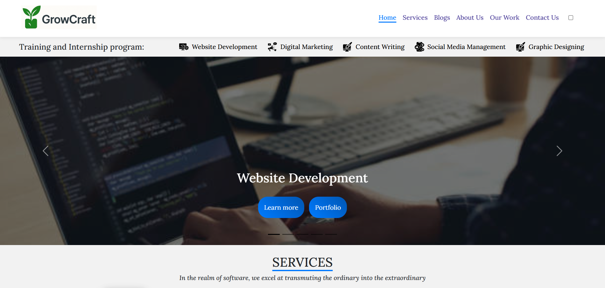
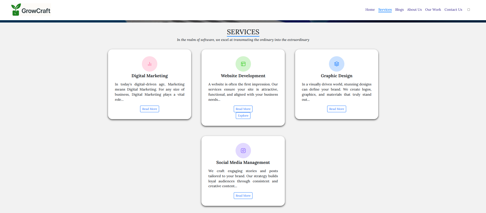

[
](https://discord.gg/mpeDXD7f)

# 🌱 GrowCraft

GrowCraft is a **service-based platform** designed to help businesses grow online while also providing students with hands-on experience through training and internships.  

> 🏆 **This repository is part of GirlScript Summer of Code 2025 (GSSoC'25)**  
> Contributions from the community are welcome!

---

## ✨ Features

- 🌐 **Website Development**
- 🖌️ **Graphic Design**
- ✍️ **Content Writing**
- 📣 **Social Media Management**
- 📊 **Digital Marketing**
- 🎓 **Training & Internship Programs**

This platform offers services to clients and creates opportunities for students to learn by doing.

---

## 📂 Folder Structure

```
GrowCraft/
├── index.html
├── blogListing.html
├── blogView.html
├── blogWrite.html
├── contact-handler.php
├── database_schema.sql
├── images/
│   ├── (images and icons used throughout the site)
├── src/
│   ├── contact.html
│   ├── blogs.css / blogs.js
│   ├── style.css / script.js
│   ├── utils.js
│   ├── web.html
│   └── css/
│       └── style.css
└── (additional documentation and assets)
```

---

## 🛠️ Tech Stack

- **Frontend:** HTML5, CSS3, Bootstrap 5.3
- **Scripting:** JavaScript (vanilla)
- **Backend (minimal):** PHP (for contact form handler)
- **Database:** MySQL (schema included)

---

<div align="center">

  <h1><u>Meet our Project Admin and Mentors</u></h1>

  <table>
    <tr>
      <td>
        <a href="https://github.com/gyanshankar1708">
          <br>
          <sub><b>Gyanshankar Singh</b></sub>
        </a>
      </td>
      <td>
        <a href="https://github.com/Khababakhtar20">
          <br>
          <sub><b>Khabab Akhtar</b></sub>
        </a>
      </td>
      <td>
        <a href="https://github.com/abdullahxyz85">
          <br>
          <sub><b>Abdullah Jameel</b></sub>
        </a>
      </td>
      <td>
        <a href="https://github.com/ayushkashyap402">
          <br>
          <sub><b>Ayush Kashyap</b></sub>
        </a>
      </td>
    </tr>
  </table>

</div>
s
---

## 🚀 Getting Started

### Prerequisites
- A modern browser
- (Optional) XAMPP / WAMP for running PHP contact form locally

### Steps
1. Clone the repository:
   ```
   git clone https://github.com/gyanshankar1708/GrowCraft.git
   ```
2. Open `index.html` in your browser to view the website.
3. (Optional) To enable the contact form:
   - Set up a local server (XAMPP/WAMP)
   - Place the project in the `htdocs` folder
   - Import `database_schema.sql` into MySQL
   - Update the PHP configuration in `contact-handler.php`

---

## 🤝 Contributing

We welcome contributions from everyone!  
If you're participating through **GSSoC'25**:

1. Look for issues labeled `GSSoC` or `good first issue`.
2. Comment on the issue you'd like to work on and wait for assignment.
3. Fork the repository, make your changes, and submit a PR.

Please read our [Contributing Guidelines](src/CONTRIBUTING.md) and [Code of Conduct](CODE_OF_CONDUCT.md) before contributing.

---

## 📷 Screenshots

### Landing Page


### Services Section


*(Add more screenshots or a GIF preview here if available)*

---

## 📜 License

This project is licensed under the terms specified in the [LICENSE](LICENSE) file.

---

## 🙌 Acknowledgements

- **GirlScript Summer of Code 2025 (GSSoC'25)** for providing an open-source platform
- Project contributors and mentors
- Open-source community for continuous inspiration
